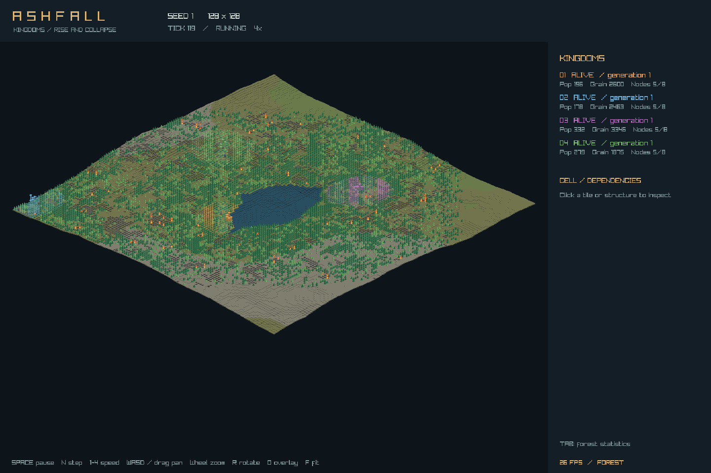

# Ashfall

A working C++20 cellular-automata simulation of competing kingdoms, with an isometric viewer and a Python reinforcement-learning baseline.

Kingdoms grow population fields, claim land, extract resources, build dependent structures, recruit military, experience epidemics, and can collapse into refugees. Five scripted policy styles and macro actions control resource allocation, construction, expansion, military objectives, and diplomacy. The headless core is deterministic and independent of graphics.



The original design contains scientific assumptions that cannot be used as universal correctness gates. [Amendment 1](docs/AMENDMENT-1.md) records the authorized corrections. This is an executable research baseline: the original headline scientific results and trained-policy convergence have **not** been established. See [implementation coverage](docs/IMPLEMENTATION.md) and [measurements](docs/VALIDATION.md).

## Build and run

Requires CMake 3.24+, a C++20 compiler, and Python 3 for tests. CMake downloads SHA-256-pinned C++ dependencies. Graphics libraries and PyTorch are unnecessary for the default build.

```sh
cmake -S . -B build -DCMAKE_BUILD_TYPE=Release
cmake --build build -j
ctest --test-dir build --output-on-failure

mkdir -p runs
./build/ashfall_headless --size 64 --seed 1 --ticks 2000 \
  --metrics runs/metrics.csv --kingdom-events runs/events.csv --out runs/kingdoms.replay
./build/ashfall_replay runs/kingdoms.replay --verify --threads 4
```

Use `--config config/default.toml` for the full 256² baseline, `--forest-only` for an isolated forest, `--empty` for the skeleton, `--warmup N` to override warmup, and `--paranoid` for every-tick replay checkpoints. The default 3,000-tick forest warmup runs before kingdoms spawn. CLI replays record scripted runs; action-driven Python sessions use the save/load interface below.

`--metrics` writes wide CSV rows every 16 ticks. `--events` writes forest events. `--kingdom-events` writes event type codes: 0 construction, 1 cascade, 2 collapse, 3 founding, 4 treaty, 5 violation. Collapse cause codes are 0 depletion, 1 administrative shortfall, 2 fire, 3 epidemic, 4 war.

## Isometric viewer

On Debian/Ubuntu, the optional viewer needs `libgl1-mesa-dev libx11-dev libxrandr-dev libxinerama-dev libxcursor-dev libxi-dev`.

```sh
cmake -S . -B build-viewer -DCMAKE_BUILD_TYPE=Release -DASHFALL_VIEWER=ON
cmake --build build-viewer -j
./build-viewer/ashfall_viewer --config config/presets/fire-lab.toml --run
```

Space pauses; N advances one tick; 1–4 request 1/4/16/64× speed; WASD or right/middle drag pans; wheel zooms; R rotates; O changes the forest/moisture/fertility overlay; F fits the map; Tab switches kingdom and forest dashboards. Click a ground tile or structure to inspect ownership, integrity, progress, and dependencies.

One-times speed targets 16 ticks/second. Work is bounded per frame to keep controls responsive; accelerated simulation can run below its requested rate on slow machines. Cached terrain may lag the current tick while dirty chunks refresh. The tested software-rendered diagnostic improved from roughly 6 FPS to 26 FPS; a universal 60 FPS guarantee is not claimed.

## Python environment and training

The default build includes `libashfall_bridge.so` (or the platform equivalent). Python uses this C++ library through ctypes. `-DASHFALL_BRIDGE=OFF` omits it. Install NumPy for the environment and PyTorch for training:

```sh
python3 -m venv .venv
. .venv/bin/activate
pip install -r python/requirements.txt
export ASHFALL_LIBRARY="$PWD/build/libashfall_bridge.so"

python python/train_mappo.py --config config/presets/curriculum-c0.toml \
  --envs 1 --iterations 10 --rollout 16 --out runs/training
python python/train_mappo.py --resume runs/training/latest.pt --envs 1 --iterations 10
python python/league.py runs/league --add runs/training/latest.pt --sample 1
```

`train_mappo.py` uses a shared convolutional actor, centralized joint-observation critic, Dirichlet allocation heads, categorical targets, GAE, clipped PPO, gradient clipping, and checkpoints. Curriculum presets C0–C5 are selectable manually. The league utility stores and samples checkpoints; automatic league training and curriculum promotion are not implemented.

```python
import sys
sys.path.insert(0, "python")
import numpy as np
from ashfall_env import AshfallEnv

with AshfallEnv('[world]\nsize=64\nforest_warmup=100\n', seed=1) as env:
    observation, info = env.reset(seed=1)
    actions = np.ones((env.num_agents, 27), dtype=np.float32)
    actions[:, 21] = 8       # consolidate
    actions[:, 22:24] = -1   # defend / no diplomatic partner
    actions[:, 24] = 5       # no treaty action
    actions[:, 25] = 0       # no quarantine
    observation, reward, terminated, truncated, info = env.step(actions)
    env.save("runs/session.json")

with AshfallEnv.load("runs/session.json") as restored:
    print(restored.digest())
```

Each observation has two 20×48×48 spatial views and 64 scalar slots. Rival channels are masked by local coverage. Actions contain 8 allocation weights, 13 construction weights, 4 integer targets, quarantine, and trade. Invalid actions are rejected before modifying the world. `VecWorld` runs independent environments concurrently. Session saves store config, seed, actions, and digest; loading replays and verifies them rather than loading a constant-time binary snapshot.

## Validation and analysis

```sh
python3 tests/integration.py --bin build --all-goldens
python tests/bridge_tests.py --library "$ASHFALL_LIBRARY"
./build/ashfall_analyze --cpr 4
python3 python/analysis/forest.py docs/data/fires-128-seed1.csv.gz docs/data/fires-256-seed1.csv.gz --check

cmake -S . -B build-sanitize -DCMAKE_BUILD_TYPE=Debug -DASHFALL_SANITIZERS=ON
cmake --build build-sanitize -j
ctest --test-dir build-sanitize --output-on-failure
```

`-DASHFALL_STATISTICAL_TESTS=ON` adds recorded-sample/fit validation to CTest. The analyzer's `--legacy-exponent-check` separately evaluates the superseded design-v1 exponent hypothesis; it still fails on the original data, which have not been altered. To collect fresh forest-only data use `ashfall_headless --forest-only --size 128 --ticks 20000 --events runs/fires.csv` (and repeat at size 256).

Core tests cover deterministic parallel forest updates, allocation-free ticks, fixed-point bounds, configuration, graph pruning/recovery, macro actions, disease/population invariants, and collapse under shortage. Eight forest and two kingdom golden replays cover 5,000 ticks each. CI definitions build GCC/Clang, sanitizers, the viewer, and a graphics-free container. Python/training smoke tests were also run locally; see the validation log for exact coverage and remaining research work.
